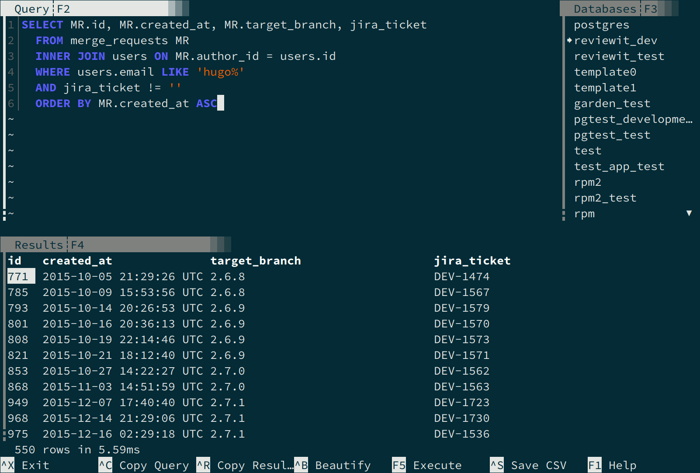

[](https://aur.archlinux.org/packages/queryit)

# Queryit

A very basic setupless terminal based SQL query runner meant to be used as a developer
tool to test queries against a project database.



## Installation

### if ArchLinux

There's an [AUR package](https://aur.archlinux.org/packages/queryit/) for it.

```
$ yay -S queryit
```

### else

Install the dependencies (dev packages if your distro split development files in separated packages):

 - Crystal compiler >= 1.0.
 - libyaml (for rails/amber database configuration detection).
 - python (compile time dependency used as build system for libtermbox).
 - libevent.
 - libsqlite3 (for sqlite support).
 - mysql-client (for mysql support).
 - postgresql-libs (for postgres support).

```
$ make
$ sudo make install
```

## Usage

On a rails or amber project directory just run it, a connection will be made to the development database:

```
$ queryit
```

Or specify the database URI:

```
$ queryit --uri postgres://localhost/database
```

## Database support

Despite of only be really tested with Postgres and SQLite, it should work with MySQL too.

## Contributing

1. Fork it (<https://github.com/hugopl/queryit/fork>)
2. Create your feature branch (`git checkout -b my-new-feature`)
3. Commit your changes (`git commit -am 'Add some feature'`)
4. Push to the branch (`git push origin my-new-feature`)
5. Create a new Pull Request

Feature suggestions are welcome, write them in github issues.

## Contributors

- [Hugo Parente Lima](https://github.com/hugopl) - creator and maintainer
